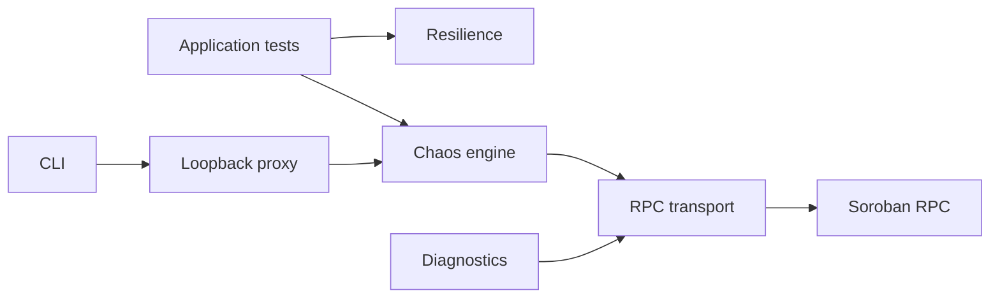

# @yesi3/soroban-rpc-chaos-kit

[](https://github.com/yesi3/soroban-rpc-chaos-kit/actions/workflows/ci.yml)
[](LICENSE)
[](package.json)
[](tests)

Deterministic fault injection and resilience primitives for Stellar Soroban JSON-RPC clients. The project is at **v0.1 pre-release**: useful for test suites and controlled local integration environments, but public APIs may still evolve with documented migration notes.

## The problem

Soroban clients can receive HTTP 200 and valid JSON while the underlying state is unsafe: a replica is several ledgers stale, failover makes ledger numbers regress, an event cursor falls outside retention, duplicate pages advance state twice, or a raw string is used where a base64 XDR topic is required. Generic HTTP mocks exercise status codes and latency; they usually miss JSON-RPC envelopes, ledger monotonicity, event retention, XDR topic encoding, and cross-call state.

This kit injects those protocol-aware failures reproducibly and supplies the corresponding defensive building blocks.

## Features

| Area | Included |
| --- | --- |
| Chaos | Composable `before`/`after`/`error` hooks, counters, seeded replay, reset |
| Stellar scenarios | Stale/regressing ledgers, retention, event gaps/duplicates/order, malformed results |
| Network faults | Deterministic timeout and rate limiting with typed metadata |
| Resilience | Retry, failover, monotonic ledger guard, restart-safe event cursor |
| Soroban data | XDR symbol topic encode/decode and contract event filters |
| Interfaces | In-process transport, loopback JSON-RPC proxy, diagnostics CLI |
| Safety | Typed errors, body limit, secret-free stats, local binding default |

## Quick starts

Install after a package release, or use `npm ci` from a checkout. This README does not claim the package is currently published.

### In-process fault injection

```ts
import { ChaosEngine, HttpRpcTransport, staleLedger } from "@yesi3/soroban-rpc-chaos-kit";

const upstream = new HttpRpcTransport("http://127.0.0.1:8000");
const rpc = new ChaosEngine(upstream, [staleLedger(3)]);
const ledger = await rpc.request("getLatestLedger");
```

### Proxy CLI

```sh
soroban-rpc-chaos scenarios
soroban-rpc-chaos scenarios --json
soroban-rpc-chaos --version

soroban-rpc-chaos proxy --upstream http://127.0.0.1:8000 --port 9000 \
  --scenario rate-limit --config '{"everyNth":5,"retryAfterMs":1000}'

soroban-rpc-chaos check http://127.0.0.1:8000 --samples 2
```

The proxy binds to `127.0.0.1`. Do not expose port 9000 publicly.

### Safe event cursor

```ts
import { SafeEventCursor } from "@yesi3/soroban-rpc-chaos-kit/resilience";

const cursor = await SafeEventCursor.seed(async () => 5_000_000);
const startLedger = cursor.nextStartLedger(4_900_000);
const unseen = cursor.observe(response.events, response.latestLedger);
const snapshot = cursor.snapshot();
```

### Correct XDR topic filters

```ts
import { buildContractEventFilter, encodeTopicSymbol } from "@yesi3/soroban-rpc-chaos-kit/resilience";

const transferTopic = encodeTopicSymbol("transfer");
const filter = buildContractEventFilter(["CA...CONTRACT"], ["transfer"]);
```

Raw `"transfer"` is not a Soroban RPC topic filter; the helper produces base64-encoded `ScVal` XDR.

## Architecture



Read [Architecture](docs/ARCHITECTURE.md), [Threat Model](docs/THREAT_MODEL.md), [Why This Project](docs/WHY_THIS_PROJECT.md), and the [Roadmap](docs/ROADMAP.md).

## Scenario catalog

| Scenario | Reproduces |
| --- | --- |
| `staleLedger` | A persistently lagging replica |
| `regressingLedger` | New-to-old replica failover |
| `retentionRejection` | `startLedger` older than retained event history |
| `timeoutScenario` | Slow or stalled upstream |
| `rateLimit` | Initial or periodic shared-RPC quota failures |
| `malformedResponse` | Missing/corrupt result fields |
| `missingEvents` | Incomplete polling window |
| `duplicateEvents` | Overlapping pages or retry replay |
| `outOfOrderEvents` | Non-monotonic event delivery |

Configuration and examples are in the full [Scenario Catalog](docs/SCENARIOS.md).

## Non-goals

- A production reverse proxy, firewall, signer, wallet, or authorization boundary
- A complete Soroban RPC server emulator or consensus/network simulator
- Hiding application errors or making unsafe cursor recovery decisions automatically
- Replacing Toxiproxy, Mock Service Worker, or application fixtures; they operate at complementary layers
- Storing credentials, production transaction envelopes, or sensitive XDR

## Contributing and community

Contributions from the wider Stellar and testing communities are welcome. Start with [Contributing](CONTRIBUTING.md), follow the [Code of Conduct](CODE_OF_CONDUCT.md), and report vulnerabilities through the private process in [Security](SECURITY.md). See the [changelog](CHANGELOG.md) for release-facing changes.

### Drips Wave contributor-ready backlog

The [Wave issue backlog](docs/WAVE_ISSUES.md) contains 36 independently scoped tasks with acceptance criteria, suggested files, complexity, and skills. The helper script can create labels and missing issues for a maintainer after review. Wave is a contribution path, not the project's sole audience or purpose.

Never put RPC credentials in CLI configuration, logs, issues, fixtures, or committed files. For authenticated upstreams, construct `HttpRpcTransport` programmatically and source headers from a secret manager.
