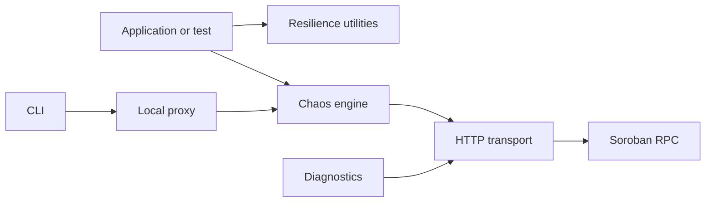
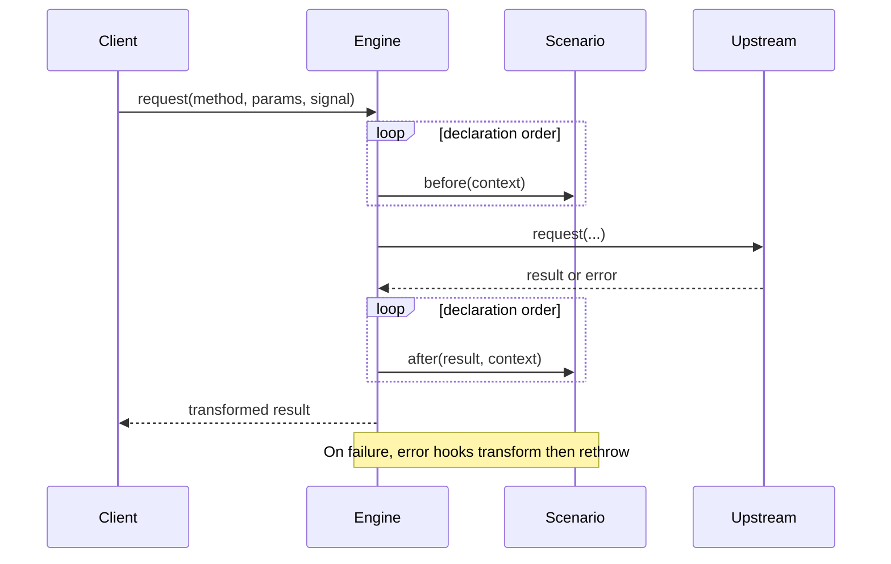

# Architecture

Soroban RPC Chaos Kit wraps an `RpcTransport` with deterministic request/response hooks. The same engine works in-process or behind a local JSON-RPC proxy.

## Layer boundaries

| Layer | Responsibility | Must not do |
| --- | --- | --- |
| Transport | JSON-RPC framing, deadlines, HTTP/error translation | Choose retries or mutate domain data |
| Chaos engine | Hook ordering, counters, reset, deterministic composition | Know HTTP or persist secrets |
| Proxy | Local HTTP boundary, body limits, JSON-RPC IDs, health/stats | Become a production gateway |
| Resilience | Retry, failover, ledger monotonicity, event cursors, XDR topics | Hide terminal failures |
| Diagnostics/CLI | Operator entry points and endpoint observations | Log headers, params, or payloads |

Imports should flow toward shared `types.ts` and `errors.ts`; resilience utilities and chaos scenarios remain independently usable.

## Hook lifecycle

`before` may fail or delay a request. `after` transforms successful results. `error` can map a failure but must preserve a meaningful cause. `reset` restores stateful scenarios and engine counters.

## Design invariants

- **Deterministic faults:** counters and seeded pseudo-randomness make runs replayable; mutable scenarios implement `reset()`.
- **Typed errors:** callers distinguish transport, timeout, rate limit, retention, malformed response, stale ledger, and exhausted failover without parsing strings.
- **No-secret design:** statistics store method counts only. Scenarios and diagnostics must not retain or log params, headers, XDR, or response bodies.
- **Protocol fidelity:** JSON-RPC IDs and Soroban ledger/event shapes are preserved unless a scenario explicitly targets them.

## Extension points

Implement `RpcTransport` for another runtime; implement `ChaosScenario` for a new fault; compose resilience around any transport; add CLI scenario factories without changing engine behavior; inject `fetch`, clocks, sleep, classifiers, and loggers for tests. Future browser, WebSocket, telemetry, persistence, and scenario-DSL adapters should depend on these interfaces rather than proxy internals.
