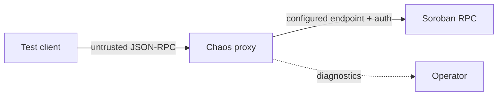

# Threat Model

## Scope and assumptions

Soroban RPC Chaos Kit is a test tool running on a developer workstation or isolated CI network. It is not hardened as an internet-facing reverse proxy, wallet, signer, transaction store, or authorization layer. The protected assets are RPC credentials, signed transactions and XDR payloads, internal network reachability, test integrity, and host availability.

The proxy is a trust boundary: client payloads and upstream responses are untrusted, while upstream URL and headers are operator-controlled.

## Principal risks

- **Network exposure:** binding beyond loopback lets other hosts submit requests or inspect diagnostics. The default is `127.0.0.1`; containers must publish only where intended and use firewall rules.
- **SSRF:** accepting an upstream URL from an untrusted user can reach loopback, link-local metadata, or private services. Keep configuration privileged, validate an allowlist, reject unexpected schemes/redirects, and isolate egress.
- **Upstream authentication:** headers grant the proxy upstream authority. Load them at runtime from a secret manager, use least-privilege short-lived tokens, terminate TLS safely, and never expose them in CLI arguments or images.
- **Sensitive transaction payloads:** `sendTransaction` may contain signed envelopes and business-sensitive data. Do not log bodies, fixtures, snapshots, traces, or failure dumps; use synthetic test accounts and redact before sharing.
- **Resource exhaustion:** slow bodies, oversized JSON, never-resolving faults, request floods, and event arrays can consume sockets or memory. Apply body/time/concurrency limits and container CPU/memory limits.
- **Control surfaces:** current health/stats are deliberately minimal and contain no params. Any future mutation API requires authentication, constant-time token comparison, CSRF-aware design, and default denial.
- **Integrity confusion:** injected responses are intentionally false. Use conspicuous test-only endpoints, isolated credentials, and never route production clients through the proxy.
- **Dependency/build compromise:** pin with the lockfile, use `npm ci`, review Dependabot changes, run CodeQL/CI, and produce provenance when publishing.

## Operational mitigations

1. Run as an unprivileged user on loopback or a private CI network.
2. Allowlist upstream HTTPS hosts and disable access to metadata/private ranges where possible.
3. Use testnet/local accounts and synthetic payloads; never use signing secrets.
4. Keep diagnostics secret-free and restrict container port `9000`.
5. Set client deadlines even when testing injected hangs.
6. Destroy ephemeral environments and rotate any accidentally exposed token.
7. Report security defects privately as described in `SECURITY.md`.

## Out of scope

The project does not protect a malicious host administrator, secure the upstream RPC implementation, validate transaction authorization, or make intentionally public endpoints private.
